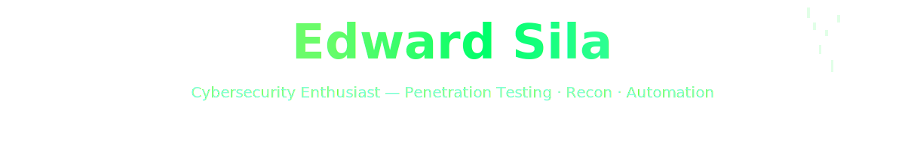

  <!-- Professional badges -->
  
  
  

  

<h2 align="center">About</h2>

<strong>Hands-on penetration tester who thinks like attackers to build stronger defenses.</strong>

  <!-- Horizontal, small colored icons for core skills/tools -->
  
  
  
  
  
  
  
  

<code>nmap</code> &middot; <code>gobuster</code> &middot; <code>Burp Suite</code> &middot; <code>git</code> &middot; <code>Python</code> &middot; <code>Bash</code>

<em>Ethical testing • Responsible disclosure • Always with permission</em>

---

  <small>Want a stronger visual header (Ubuntu font or SVG banner)? I can generate an SVG banner and add it as `assets/header.svg` — say the word and I’ll create it.</small>

